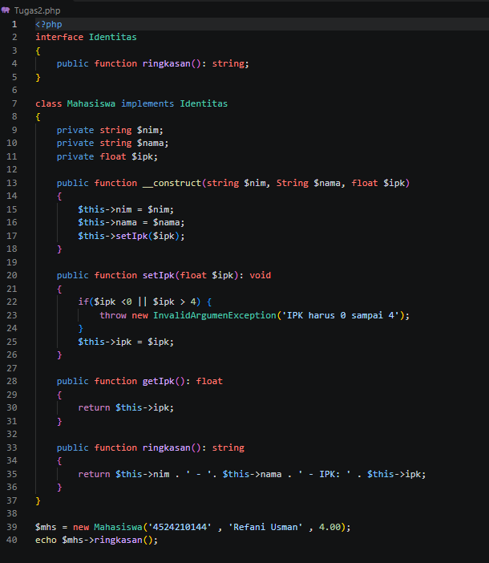
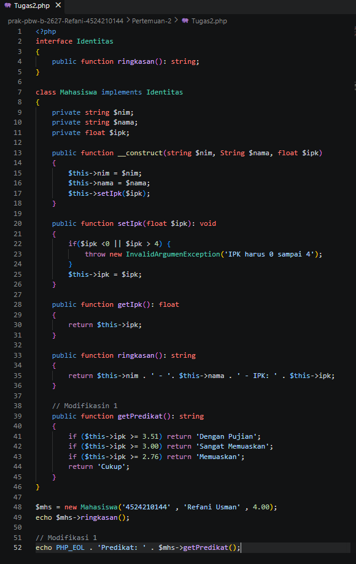
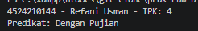
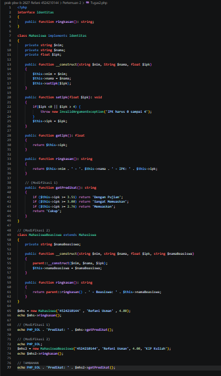
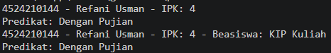

# Tugas 2 Praktikum PBW

## 1. Hasil Pengerjaan

Pada tugas ini, program PHP berbasis OOP dengan class `Mahasiswa` yang mengimplementasikan interface `Identitas` berhasil dijalankan tanpa error kritis.

Program dapat melakukan:
- Menyimpan data mahasiswa (NIM, nama, dan IPK)
- Menampilkan ringkasan data mahasiswa melalui method `ringkasan()`
- Membatasi nilai IPK agar hanya bisa diisi antara 0 sampai 4

Contoh output:

4524210144 - Refani Usman - IPK: 4

---

## 2. Modifikasi Program

### Modifikasi 1 — Menambahkan Method `getPredikat()`

Program awal hanya menampilkan NIM, nama, dan IPK.

Modifikasi pertama adalah menambahkan method `getPredikat()` pada class `Mahasiswa` untuk menentukan predikat kelulusan berdasarkan IPK.

Contoh:

IPK 4.00 → Dengan Pujian

Penambahan ini dilakukan dengan menambah method baru di dalam class `Mahasiswa` dan memanggilnya pada bagian akhir program.

### Modifikasi 2 — Menambahkan Class Turunan `MahasiswaBeasiswa`

Program awal hanya memiliki satu class, yaitu `Mahasiswa`.

Setelah dimodifikasi, ditambahkan class `MahasiswaBeasiswa` yang mewarisi (`extends`) class `Mahasiswa` dan memiliki properti tambahan `namaBeasiswa`. Method `ringkasan()` di-override untuk menampilkan nama beasiswa.

Contoh:

4524210144 - Refani Usman - IPK: 4 - Beasiswa: KIP Kuliah

Karena mewarisi `Mahasiswa`, class ini juga otomatis bisa memakai `getPredikat()` tanpa menulis ulang.

---

## 3. Screenshot Sebelum Modifikasi

---

## 4. Screenshot Sesudah Modifikasi

---

## 5. Penjelasan 5 Bagian Kode Penting

### 1. Interface

`interface Identitas` mendefinisikan method `ringkasan()` yang wajib dimiliki oleh setiap class yang mengimplementasikannya. Class `Mahasiswa` memakai `implements Identitas` sehingga harus menyediakan isi dari method tersebut.

### 2. Properti Private (Enkapsulasi)

Properti `$nim`, `$nama`, dan `$ipk` dideklarasikan `private` sehingga tidak bisa diubah langsung dari luar class. Data hanya bisa diakses melalui method seperti `getIpk()` dan `setIpk()`.

### 3. Constructor

`__construct()` dijalankan otomatis saat objek dibuat dengan `new`. Constructor mengisi nilai NIM, nama, dan IPK, dan untuk IPK memanggil `setIpk()` agar nilainya divalidasi terlebih dahulu.

### 4. Validasi pada `setIpk()`

`setIpk()` memeriksa apakah IPK berada di antara 0 sampai 4. Jika tidak, program melempar exception dengan pesan "IPK harus 0 sampai 4". Dengan begitu data IPK yang tersimpan selalu valid.

### 5. Pewarisan dan Override Method

Class `MahasiswaBeasiswa extends Mahasiswa` mewarisi seluruh method class induk. Method `ringkasan()` di-override dan memanggil `parent::ringkasan()` untuk mengambil teks dari class induk, lalu menambahkan informasi beasiswa.

---

## 6. Error yang Pernah Muncul

### Error 1

Output tampil dalam satu baris panjang di browser, padahal seharusnya terpisah per baris.

### Penyebab

`PHP_EOL` menghasilkan karakter baris baru (`\n`), tetapi browser membaca output PHP sebagai HTML. Pada HTML, `\n` dianggap sebagai spasi biasa sehingga semua baris menyatu.

### Perbaikan

Mengganti `PHP_EOL` dengan ` ` pada bagian yang menampilkan baris baru. Alternatif lain adalah menambahkan `header('Content-Type: text/plain');` di bagian atas file, atau menjalankan program lewat terminal dengan perintah `php nama_file.php`.

### Error 2 (catatan pada kode)

Pada kode terdapat penulisan `InvalidArgumenException` (kurang huruf "t") yang seharusnya `InvalidArgumentException`.

### Penyebab

Nama class exception salah ketik. Jika IPK yang dimasukkan di luar rentang 0 sampai 4, PHP akan menampilkan error `Class "InvalidArgumenException" not found`, bukan pesan validasi yang diharapkan.

### Perbaikan

Menulis ulang nama class menjadi `InvalidArgumentException`. Pada pengujian dengan IPK 4.00 error ini tidak muncul karena kondisi validasi tidak terpenuhi.

---

## 7. Kesimpulan

Program PHP OOP berhasil dijalankan dan dimodifikasi dengan menambahkan method `getPredikat()` serta class turunan `MahasiswaBeasiswa`. Modifikasi tersebut memperlihatkan penerapan konsep interface, enkapsulasi, constructor, dan pewarisan, serta membuat program memiliki fungsi tambahan dibandingkan program awal.