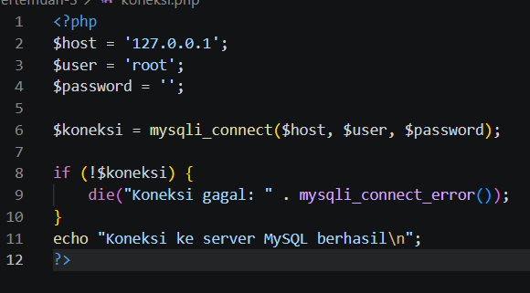
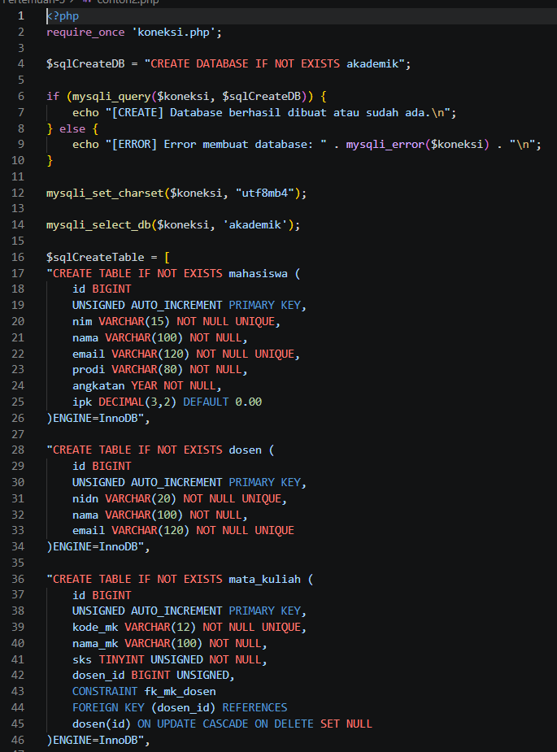
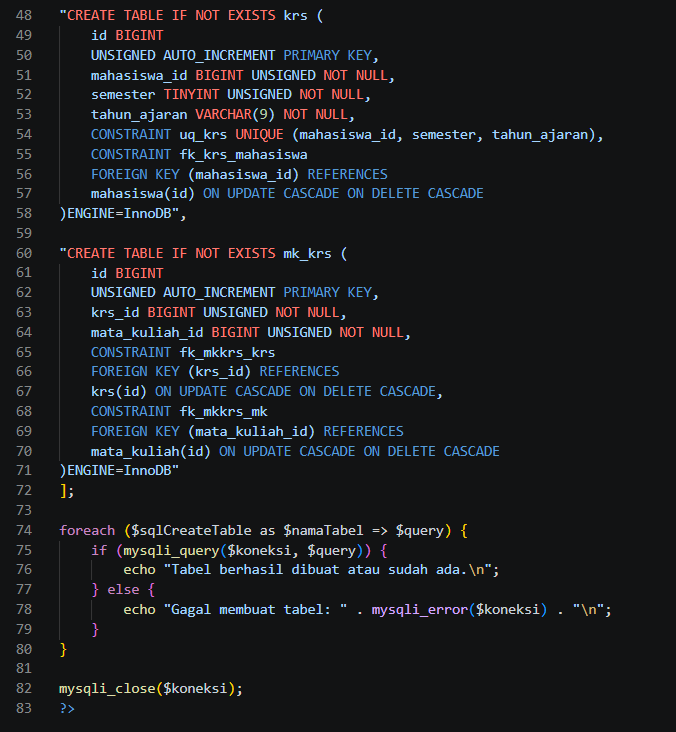
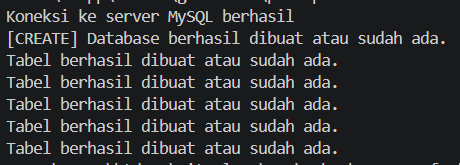
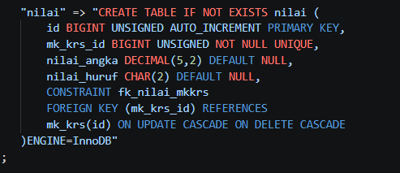
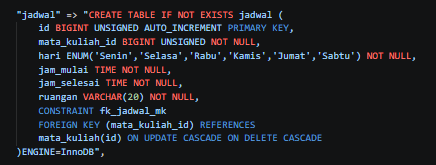
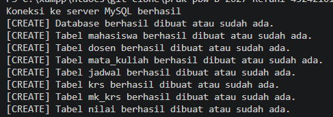

# Tugas 3 Praktikum PBW

## 1. Hasil Pengerjaan

Pada tugas ini, program PHP yang memakai library `mysqli` untuk membuat database `akademik` beserta tabel-tabelnya berhasil dijalankan tanpa error kritis.

Program dapat melakukan:
- Membuat database `akademik` apabila belum ada
- Mengatur charset koneksi ke `utf8mb4`
- Membuat lima tabel awal: `mahasiswa`, `dosen`, `mata_kuliah`, `krs`, dan `mk_krs`
- Menghubungkan tabel-tabel tersebut dengan foreign key
- Menampilkan pesan keberhasilan atau pesan error untuk setiap query

Contoh output:

```
[CREATE] Database berhasil dibuat atau sudah ada.
Tabel berhasil dibuat atau sudah ada.
Tabel berhasil dibuat atau sudah ada.
Tabel berhasil dibuat atau sudah ada.
Tabel berhasil dibuat atau sudah ada.
Tabel berhasil dibuat atau sudah ada.
```

---

## 2. Modifikasi Program

### Modifikasi 1 — Menambahkan Tabel `jadwal`

Program awal hanya memiliki lima tabel dan belum menyimpan informasi kapan serta di mana mata kuliah diajarkan.

Modifikasi pertama adalah menambahkan tabel `jadwal` yang berisi kolom `hari`, `jam_mulai`, `jam_selesai`, dan `ruangan`. Tabel ini memiliki foreign key `mata_kuliah_id` yang merujuk ke tabel `mata_kuliah`, sehingga satu mata kuliah bisa memiliki lebih dari satu jadwal.

Contoh:

```
[CREATE] Tabel jadwal berhasil dibuat atau sudah ada.
```

Penambahan ini dilakukan dengan menambah satu elemen baru di dalam array `$sqlCreateTable`, diletakkan setelah tabel `mata_kuliah` agar tabel yang direferensikan sudah ada lebih dulu.

### Modifikasi 2 — Menambahkan Tabel `nilai`

Program awal belum bisa menyimpan nilai akhir dari mata kuliah yang diambil mahasiswa.

Setelah dimodifikasi, ditambahkan tabel `nilai` dengan kolom `nilai_angka` dan `nilai_huruf`. Tabel ini memiliki foreign key `mk_krs_id` yang merujuk ke tabel `mk_krs`. Kolom `mk_krs_id` diberi constraint `UNIQUE` sehingga setiap mata kuliah dalam KRS hanya memiliki satu nilai.

Contoh:

```
[CREATE] Tabel nilai berhasil dibuat atau sudah ada.
```

Tabel ini diletakkan di akhir array karena bergantung pada tabel `mk_krs`.

### Perubahan Pendukung — Array Asosiatif

Array `$sqlCreateTable` diubah menjadi array asosiatif (`"nama_tabel" => "query"`) sehingga pesan output dapat menyebut nama tabel yang sedang dibuat.

---

## 3. Screenshot Sebelum Modifikasi










---

## 4. Screenshot Modifikasi







---

## 5. Penjelasan 5 Bagian Kode Penting

### 1. Koneksi dan Pembuatan Database

`require_once 'koneksi.php'` memuat file koneksi yang menyediakan variabel `$koneksi`. Setelah itu query `CREATE DATABASE IF NOT EXISTS akademik` dijalankan, sehingga database hanya dibuat jika belum ada dan program aman dijalankan berulang kali.

### 2. Pengaturan Charset dan Pemilihan Database

`mysqli_set_charset($koneksi, "utf8mb4")` mengatur charset koneksi agar mendukung karakter Unicode secara penuh. Kemudian `mysqli_select_db($koneksi, 'akademik')` memilih database yang baru dibuat sebagai database aktif untuk query-query berikutnya.

### 3. Array Query `CREATE TABLE`

Seluruh query pembuatan tabel dikumpulkan dalam array `$sqlCreateTable`. Setiap query memakai `CREATE TABLE IF NOT EXISTS` dan `ENGINE=InnoDB`. Engine InnoDB dipilih karena mendukung foreign key. Penyimpanan dalam array membuat penambahan tabel baru cukup dengan menambah satu elemen.

### 4. Foreign Key dan Constraint

Relasi antartabel dibuat dengan `FOREIGN KEY ... REFERENCES`. Contohnya `mata_kuliah.dosen_id` memakai `ON DELETE SET NULL`, sehingga mata kuliah tidak ikut terhapus saat dosennya dihapus, sedangkan `krs` dan `mk_krs` memakai `ON DELETE CASCADE`. Selain itu `UNIQUE (mahasiswa_id, semester, tahun_ajaran)` pada tabel `krs` mencegah mahasiswa memiliki KRS ganda di semester yang sama.

### 5. Perulangan Eksekusi Query dan Penanganan Error

`foreach` menjalankan setiap query dengan `mysqli_query()`. Jika berhasil, program menampilkan pesan sukses. Jika gagal, pesan error diambil dari `mysqli_error()`. Di bagian akhir, `mysqli_close()` menutup koneksi ke database.

---

## 6. Error yang Pernah Muncul

### Error 

Pesan output tidak menyebut nama tabel, padahal seharusnya menunjukkan tabel mana yang berhasil atau gagal dibuat.

### Penyebab

Array `$sqlCreateTable` ditulis tanpa key, sehingga variabel `$namaTabel` pada `foreach` hanya berisi angka indeks (0, 1, 2, dst.), bukan nama tabel.

### Perbaikan

Mengubah array menjadi asosiatif, misalnya `"mahasiswa" => "CREATE TABLE ..."`, lalu menampilkan `$namaTabel` pada pesan output.

---

## 7. Kesimpulan

Program PHP untuk membuat database akademik berhasil dijalankan dan dimodifikasi dengan menambahkan tabel `jadwal` serta tabel `nilai`. Modifikasi tersebut memperlihatkan penerapan konsep pembuatan database dengan `mysqli`, relasi antartabel menggunakan foreign key, serta urutan pembuatan tabel berdasarkan dependensinya, sehingga struktur database menjadi lebih lengkap dibandingkan program awal.