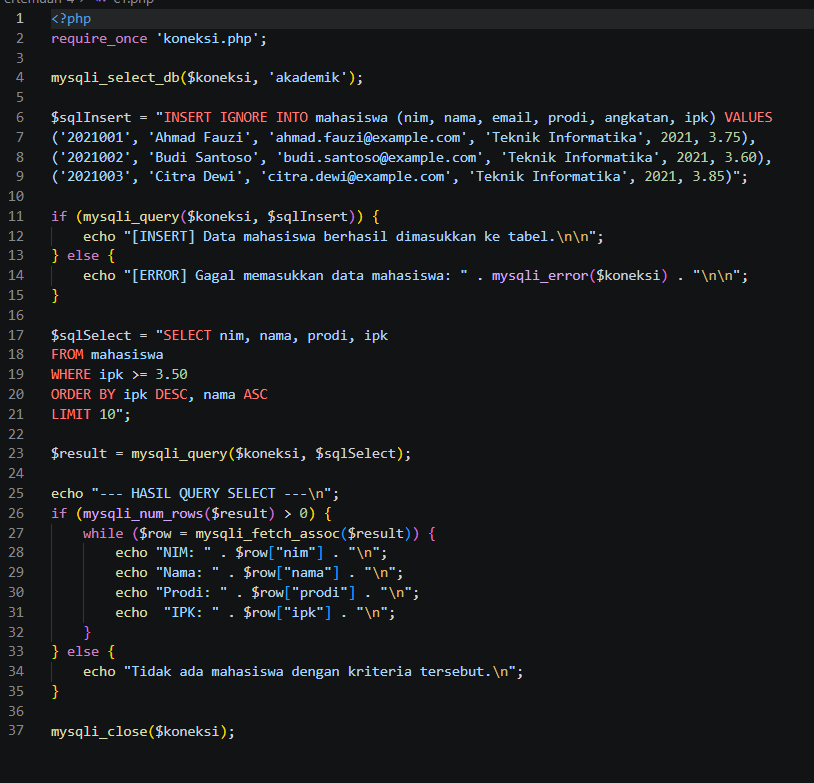
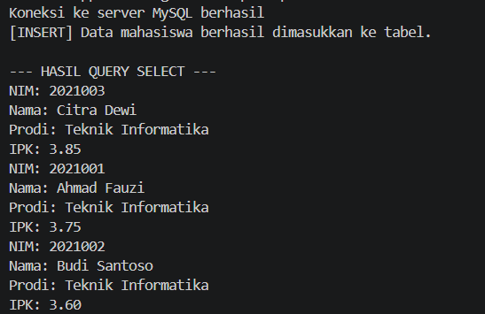
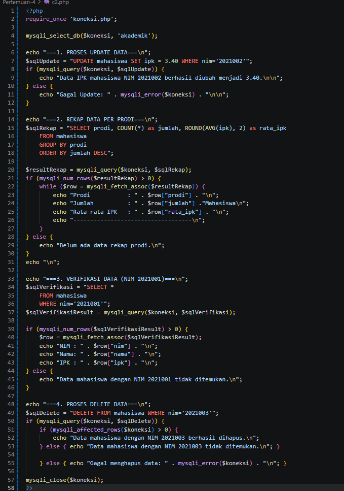
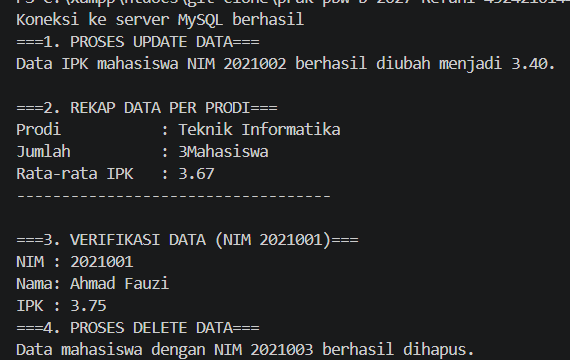
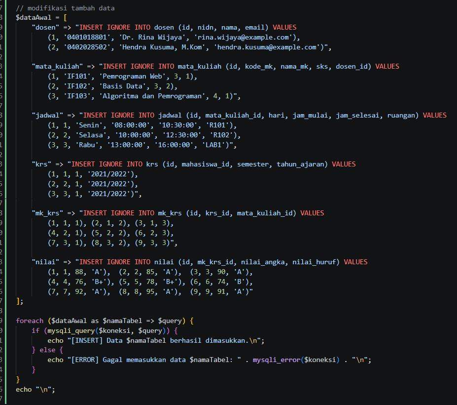
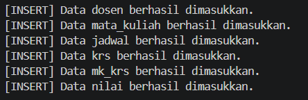
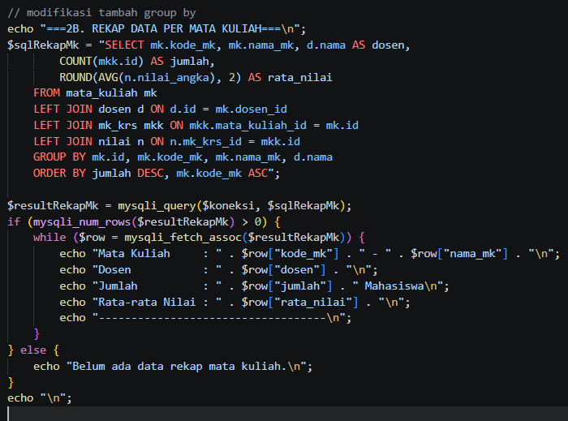
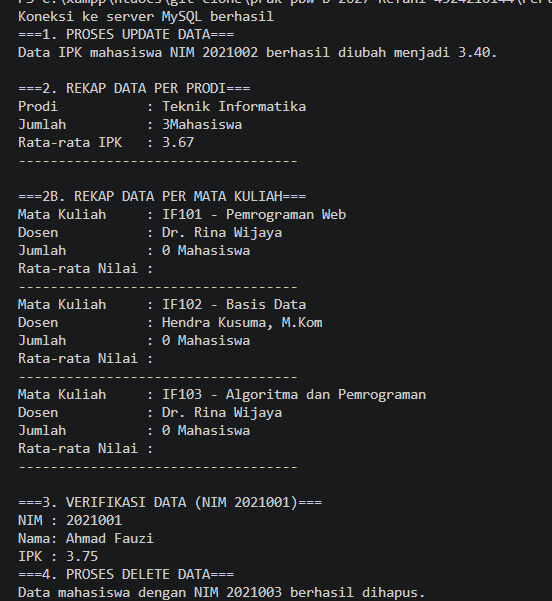

# Tugas 4 Praktikum PBW

## 1. Hasil Pengerjaan

Pada tugas ini, dua program PHP yang memakai library `mysqli` untuk memanipulasi data pada database `akademik` berhasil dijalankan tanpa error kritis.

**Program 1** melakukan:
- Memasukkan data mahasiswa dengan `INSERT IGNORE`
- Menampilkan mahasiswa ber-IPK minimal 3.50 dengan `SELECT`, diurutkan dari IPK tertinggi dan dibatasi 10 data

**Program 2** melakukan:
- Mengubah IPK mahasiswa dengan `UPDATE`
- Menampilkan rekap jumlah mahasiswa dan rata-rata IPK per prodi dengan `GROUP BY`
- Memverifikasi data satu mahasiswa dengan `SELECT ... WHERE`
- Menghapus data mahasiswa dengan `DELETE`

Contoh output Program 1:

```
[INSERT] Data mahasiswa berhasil dimasukkan ke tabel.

--- HASIL QUERY SELECT ---
NIM: 2021003
Nama: Citra Dewi
Prodi: Teknik Informatika
IPK: 3.85
NIM: 2021001
Nama: Ahmad Fauzi
Prodi: Teknik Informatika
IPK: 3.75
NIM: 2021002
Nama: Budi Santoso
Prodi: Teknik Informatika
IPK: 3.60
```

Contoh output Program 2:

```
===1. PROSES UPDATE DATA===
Data IPK mahasiswa NIM 2021002 berhasil diubah menjadi 3.40.

===2. REKAP DATA PER PRODI===
Prodi           : Teknik Informatika
Jumlah          : 3Mahasiswa
Rata-rata IPK   : 3.67
-----------------------------------
```

---

## 2. Modifikasi Program

### Modifikasi 1 — Menambahkan Data Awal ke Tabel Lain (Program 1)

Program awal hanya mengisi tabel `mahasiswa`, sehingga tabel lain seperti `dosen`, `mata_kuliah`, `jadwal`, `krs`, `mk_krs`, dan `nilai` masih kosong.

Modifikasi pertama adalah menambahkan blok `$dataAwal` berupa array asosiatif yang berisi query `INSERT IGNORE` untuk keenam tabel tersebut, lalu dijalankan dengan `foreach`. Data yang ditambahkan:
- 2 dosen
- 3 mata kuliah
- 3 jadwal
- 3 KRS (satu per mahasiswa)
- 9 baris `mk_krs` (tiap mahasiswa mengambil 3 mata kuliah)
- 9 nilai

Contoh:

```
[INSERT] Data dosen berhasil dimasukkan.
[INSERT] Data mata_kuliah berhasil dimasukkan.
[INSERT] Data jadwal berhasil dimasukkan.
[INSERT] Data krs berhasil dimasukkan.
[INSERT] Data mk_krs berhasil dimasukkan.
[INSERT] Data nilai berhasil dimasukkan.
```

Blok ini disisipkan setelah `INSERT` mahasiswa dan sebelum `SELECT`, tanpa mengubah kode asli.

### Modifikasi 2 — Menambahkan Rekap Per Mata Kuliah (Program 2)

Program awal hanya memiliki rekap `GROUP BY` per prodi dari satu tabel.

Setelah dimodifikasi, ditambahkan bagian `2B. REKAP DATA PER MATA KULIAH` tanpa menghapus rekap per prodi. Query barunya menggabungkan empat tabel (`mata_kuliah`, `dosen`, `mk_krs`, `nilai`) dengan `LEFT JOIN`, lalu dikelompokkan per mata kuliah dengan `GROUP BY` dan fungsi agregat `COUNT` serta `AVG`.

Contoh:

```
===2B. REKAP DATA PER MATA KULIAH===
Mata Kuliah     : IF101 - Pemrograman Web
Dosen           : Dr. Rina Wijaya
Jumlah          : 3 Mahasiswa
Rata-rata Nilai : 85.33
-----------------------------------
Mata Kuliah     : IF102 - Basis Data
Dosen           : Hendra Kusuma, M.Kom
Jumlah          : 3 Mahasiswa
Rata-rata Nilai : 86.00
-----------------------------------
Mata Kuliah     : IF103 - Algoritma dan Pemrograman
Dosen           : Dr. Rina Wijaya
Jumlah          : 3 Mahasiswa
Rata-rata Nilai : 85.00
-----------------------------------
```

Karena memakai `LEFT JOIN`, mata kuliah yang belum memiliki peserta atau nilai tetap ditampilkan.

---

## 3. Screenshot Sebelum Modifikasi Program 1





---

## 3.1 Screenshot Sebelum Modifikasi Program 2





---

## 4. Screenshot Sesudah Modifikasi Program 1





---

## 4.1 Screenshot Sesudah Modifikasi Program 2





---

## 5. Penjelasan 5 Bagian Kode Penting

### 1. `INSERT IGNORE`

Query `INSERT IGNORE INTO mahasiswa ... VALUES (...), (...), (...)` memasukkan beberapa baris sekaligus. Kata `IGNORE` membuat MySQL melewati baris yang melanggar constraint `UNIQUE` (misalnya NIM atau email yang sudah ada) tanpa menghentikan program. Dengan begitu program aman dijalankan berulang kali.

### 2. Array `$dataAwal` dan Urutan Insert

Query insert untuk tabel tambahan dikumpulkan dalam array asosiatif lalu dijalankan dengan `foreach`, sehingga pesan sukses atau error menyebut nama tabelnya. Urutan elemen harus mengikuti dependensi foreign key: `dosen` sebelum `mata_kuliah`, `krs` sebelum `mk_krs`, dan `mk_krs` sebelum `nilai`. Jika urutannya terbalik, insert gagal karena foreign key.

### 3. `SELECT` dengan `WHERE`, `ORDER BY`, dan `LIMIT`

Query `SELECT` memfilter mahasiswa dengan `WHERE ipk >= 3.50`, mengurutkan dengan `ORDER BY ipk DESC, nama ASC`, dan membatasi hasil dengan `LIMIT 10`. Hasilnya dibaca baris demi baris memakai `mysqli_fetch_assoc()` di dalam `while`, dan `mysqli_num_rows()` dipakai untuk mengecek apakah ada data.

### 4. `UPDATE` dan `DELETE`

`UPDATE mahasiswa SET ipk = 3.40 WHERE nim='2021002'` mengubah satu baris tertentu. Pada `DELETE`, `mysqli_affected_rows()` dipakai untuk membedakan antara query yang berhasil menghapus data dan query yang berhasil dijalankan tetapi tidak menemukan data. Karena tabel `krs` memakai `ON DELETE CASCADE`, penghapusan mahasiswa juga menghapus KRS, `mk_krs`, dan nilai miliknya.

### 5. `GROUP BY` dengan Fungsi Agregat dan `JOIN`

`GROUP BY prodi` mengelompokkan mahasiswa per prodi, lalu `COUNT(*)` menghitung jumlahnya dan `ROUND(AVG(ipk), 2)` menghitung rata-rata IPK. Pada rekap per mata kuliah, `LEFT JOIN` menggabungkan empat tabel, sedangkan `GROUP BY` mengelompokkan hasilnya per mata kuliah agar `COUNT` dan `AVG` dihitung untuk tiap mata kuliah.

---

## 6. Error yang Pernah Muncul

### Error 

Insert pada tabel `krs` gagal dengan pesan error foreign key.

### Penyebab

Data `krs` memakai `mahasiswa_id` 1, 2, dan 3. Jika tabel `mahasiswa` pernah berisi data yang dihapus, kolom `AUTO_INCREMENT` melanjutkan dari angka yang lebih besar, sehingga `id` tersebut tidak ada di tabel `mahasiswa`.

### Perbaikan

Mengosongkan tabel `mahasiswa` (dan tabel yang bergantung padanya) lalu menjalankan ulang program, atau mengisi relasi memakai subquery berdasarkan NIM, bukan `id` tetap.

---

## 7. Kesimpulan

Kedua program PHP berhasil dijalankan dan dimodifikasi dengan menambahkan data awal pada seluruh tabel serta rekap per mata kuliah menggunakan `JOIN` dan `GROUP BY`. Modifikasi tersebut memperlihatkan penerapan operasi `INSERT`, `SELECT`, `UPDATE`, dan `DELETE`, fungsi agregat, penggabungan beberapa tabel, serta pengaruh foreign key terhadap urutan insert dan penghapusan data, sehingga program menampilkan data yang lebih lengkap dibandingkan program awal.